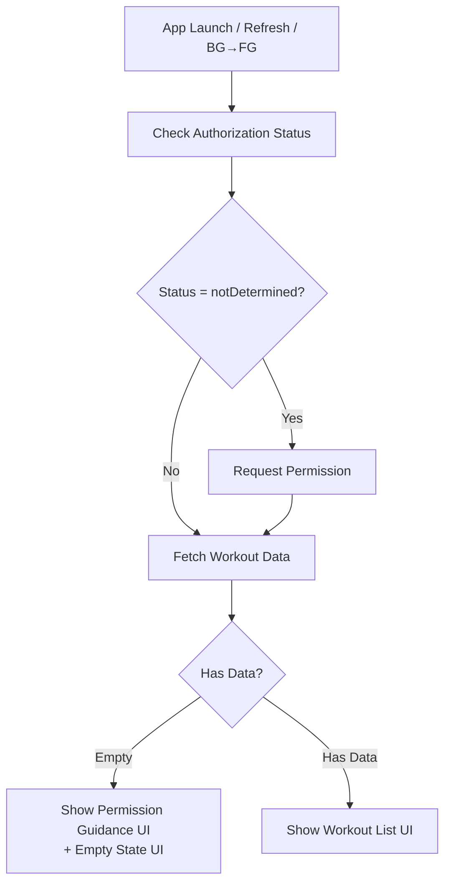
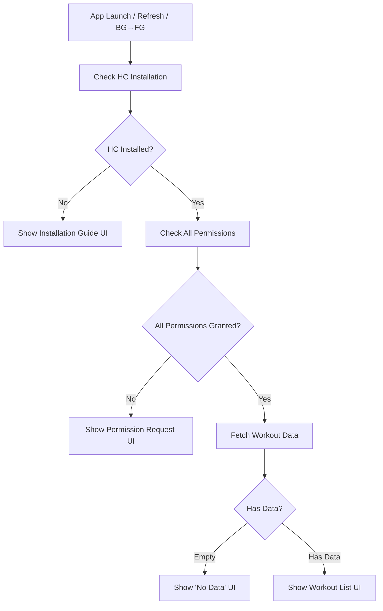

# iOS · Android Health Permission & Data Processing Complete Refactoring Specification

**Version:** 1.0
**Date:** 2025-12-09
**Status:** Design Complete - Ready for Implementation

---

## 📋 Table of Contents

1. [Overview](#overview)
2. [Common Goals](#common-goals)
3. [iOS (HealthKit) Requirements](#ios-healthkit-requirements)
4. [Android (Health Connect) Requirements](#android-health-connect-requirements)
5. [Background-to-Foreground State Comparison](#background-to-foreground-state-comparison)
6. [State Machine Design](#state-machine-design)
7. [Architecture Overview](#architecture-overview)
8. [Implementation Plan](#implementation-plan)

---

## 🎯 Overview

This document specifies a complete redesign of the iOS (HealthKit) and Android (Health Connect) permission and data loading flows. The existing implementation will be **completely replaced** with a new state-machine-based architecture.

### Key Principles

1. **State-driven architecture**: All UI and behavior determined by explicit states
2. **Platform-aware**: Respects iOS and Android policy differences
3. **Predictable flow**: Always follows "Permission Check → Data Load" sequence
4. **Smart refresh**: Compares previous/current states to avoid unnecessary refreshes

---

## 🎯 Common Goals

The app must always operate in the following order:

```
Permission Check → Data Load
```

This applies to:
- App launch
- Refresh button press
- Background → Foreground transition (with state comparison)

### Background-to-Foreground Behavior

When returning from background:

```
Compare previous state with current state:
  ├─ States changed? → Auto refresh
  ├─ Previous state was null? → Auto refresh
  └─ States identical? → Skip refresh (prevent UX flicker)
```

### Platform Policy Differences

**iOS (HealthKit):**
- Apps cannot revoke permissions
- Cannot distinguish "no data" from "no permission" via API
- Must always show permission guidance if data is empty

**Android (Health Connect):**
- Requires Health Connect app installation
- Can explicitly check permission status
- Can distinguish "no data" from "no permission"
- Must show installation UI if Health Connect not installed

---

## 📱 iOS (HealthKit) Requirements

### 1. Permission Model Characteristics

- **HealthKit permissions cannot be revoked by the app**, only by user in Settings
- **Privacy protection**: HealthKit API cannot distinguish between:
  - "Data truly doesn't exist (empty)"
  - "Data exists but hidden due to lack of permission"
- This is **by design** and is correct per Apple's privacy policy

### 2. iOS UX Policy

```
IF workout data fetch returns empty
  → Cannot determine if permission exists or not
  → ALWAYS show permission guidance UI
```

### 3. iOS State Definitions

| State Property | Description |
|---------------|-------------|
| `authorizationStatus` | HealthKit authorization status |
| `hasWorkoutData` | Whether fetch returned any data |

### 4. iOS Complete Flow



**Flow Description:**

1. **App Launch / Refresh / Background→Foreground**
2. **Check authorization status**
3. **If `notDetermined`** → Request permission
4. **Regardless of permission result** → Fetch workout data
5. **If workout data is empty:**
   - Show permission guidance UI (Settings button)
   - Show empty state UI
   - **Reason**: Cannot distinguish between "no permission" and "no data"
6. **If workout data exists:**
   - Show normal workout list UI

---

## 🤖 Android (Health Connect) Requirements

### 1. Required Conditions for App Operation

**Both conditions must be met:**
1. Health Connect app is installed
2. All required permissions are granted

### 2. Android Complete Flow



**Flow Description:**

1. **App Launch / Refresh / Background→Foreground**
2. **Check Health Connect installation**
   - If not installed → Show installation guide UI
3. **Check all required permissions**
   - If any permission denied → Show permission request UI
4. **All permissions OK** → Fetch workout data
5. **If workout data is empty:**
   - Show "No Data" UI
   - **Reason**: Android can distinguish empty from permission issues
6. **If workout data exists:**
   - Show normal workout list UI

---

## 🔁 Background-to-Foreground State Comparison

### Stored Previous Values

```dart
class HealthStatePersistence {
  HealthAuthorizationStatus? previousAuthorizationStatus;
  HealthConnectInstallStatus? previousInstallStatus; // Android only
}
```

### Comparison Logic

```dart
void onResume() {
  final current = getCurrentHealthState();

  if (previousAuthorizationStatus == null) {
    // First time or no previous state
    refresh();
  }
  else if (previousAuthorizationStatus != current.authorizationStatus) {
    // Authorization changed
    refresh();
  }
  else if (Platform.isAndroid &&
           previousInstallStatus != current.installStatus) {
    // Android: Installation status changed
    refresh();
  }
  else {
    // No changes - skip refresh to prevent UX flicker
    // Do nothing
  }
}
```

### State Change Examples

| Previous State | Current State | Action | Reason |
|---------------|--------------|--------|--------|
| `null` | Any | Refresh | First launch |
| `notDetermined` | `denied` | Refresh | User denied permission |
| `granted` | `granted` | Skip | No change |
| `denied` | `granted` | Refresh | User granted permission |
| Not Installed | Installed | Refresh | User installed HC |

---

## 🎮 State Machine Design

### State Definitions

```dart
enum HealthUIState {
  // Loading states
  loading,                    // Permission/data checking in progress

  // iOS-specific permission states
  iosPermissionRequired,      // HealthKit data empty → show permission guidance
  iosWorkoutEmpty,           // Empty + permission guidance

  // Android-specific states
  androidHCNotInstalled,      // Health Connect app not installed
  androidPermissionRequired,  // HC installed but permissions denied
  androidWorkoutEmpty,        // Just empty (no permission issues)

  // Success states
  workoutLoaded,             // Data loaded successfully

  // Error states
  error,                     // General error
}
```

### State Transition Matrix

#### iOS State Transitions

```
        Event                    Current State              Next State
─────────────────────────────────────────────────────────────────────────
App Launch                   →   ANY                    →   loading
Check Permission            →   loading                 →   (depends on result)
  └─ notDetermined          →   loading                 →   (request) → loading
  └─ Result: Empty Data     →   loading                 →   iosWorkoutEmpty
  └─ Result: Has Data       →   loading                 →   workoutLoaded
  └─ Result: Error          →   loading                 →   error

Refresh Button              →   ANY                    →   loading → (repeat check)
BG → FG (state changed)     →   ANY                    →   loading → (repeat check)
BG → FG (no change)         →   ANY                    →   (no change)
```

#### Android State Transitions

```
        Event                    Current State              Next State
─────────────────────────────────────────────────────────────────────────
App Launch                   →   ANY                    →   loading
Check Installation          →   loading                 →   (depends on result)
  └─ Not Installed          →   loading                 →   androidHCNotInstalled
  └─ Installed              →   loading                 →   (check permissions)
    └─ Permission Denied    →   loading                 →   androidPermissionRequired
    └─ All Granted          →   loading                 →   (fetch data)
      └─ Empty              →   loading                 →   androidWorkoutEmpty
      └─ Has Data           →   loading                 →   workoutLoaded
      └─ Error              →   loading                 →   error

Install HC Button           →   androidHCNotInstalled  →   (open Play Store)
Grant Permission Button     →   androidPermissionRequired → (open permission screen)
Refresh Button              →   ANY                    →   loading → (repeat check)
BG → FG (state changed)     →   ANY                    →   loading → (repeat check)
BG → FG (no change)         →   ANY                    →   (no change)
```

---

## 🏗️ Architecture Overview

### Layer Structure

```
┌─────────────────────────────────────────────────┐
│           Presentation Layer                    │
│  ┌─────────────────────────────────────────┐   │
│  │  UI (Dashboard)                         │   │
│  │  - State-based rendering                │   │
│  │  - Platform-specific widgets            │   │
│  └─────────────────────────────────────────┘   │
│  ┌─────────────────────────────────────────┐   │
│  │  BLoC (HealthBloc)                      │   │
│  │  - State machine logic                  │   │
│  │  - Event handling                       │   │
│  │  - BG→FG state comparison               │   │
│  └─────────────────────────────────────────┘   │
└─────────────────────────────────────────────────┘
                      ↓
┌─────────────────────────────────────────────────┐
│           Domain Layer                          │
│  ┌─────────────────────────────────────────┐   │
│  │  Use Cases                              │   │
│  │  - CheckHealthPermission                │   │
│  │  - RequestHealthPermission              │   │
│  │  - FetchWorkoutData                     │   │
│  │  - CheckHealthConnectInstallation       │   │
│  └─────────────────────────────────────────┘   │
│  ┌─────────────────────────────────────────┐   │
│  │  Repository Interface                   │   │
│  └─────────────────────────────────────────┘   │
└─────────────────────────────────────────────────┘
                      ↓
┌─────────────────────────────────────────────────┐
│           Data Layer                            │
│  ┌─────────────────────────────────────────┐   │
│  │  Repository Implementation              │   │
│  │  - Platform detection                   │   │
│  │  - Datasource routing                   │   │
│  └─────────────────────────────────────────┘   │
│  ┌──────────────────┐   ┌─────────────────┐   │
│  │  iOS DataSource  │   │ Android DS      │   │
│  │  - HealthKit     │   │ - Health Connect│   │
│  └──────────────────┘   └─────────────────┘   │
└─────────────────────────────────────────────────┘
```

### Key Components

1. **HealthBloc**: Central state machine controller
   - Manages all health-related events
   - Maintains state persistence for BG→FG comparison
   - Emits UI states based on platform-specific logic

2. **Platform-Specific DataSources**:
   - **iOS**: HealthKitDataSource
   - **Android**: HealthConnectDataSource

3. **Use Cases** (following Single Responsibility):
   - `CheckHealthPermission`: Query current permission status
   - `RequestHealthPermission`: Request new permissions
   - `FetchWorkoutData`: Load workout data
   - `CheckHealthConnectInstallation`: Android-only, check if HC installed

4. **State Persistence Service**:
   - Stores previous authorization/installation status
   - Provides comparison logic for BG→FG transitions

---

## 🎨 UI State Mapping

### iOS UI States

| State | UI Components |
|-------|--------------|
| `loading` | Loading indicator |
| `iosWorkoutEmpty` | Permission guidance card + Empty state illustration |
| `workoutLoaded` | Workout list with summary cards |
| `error` | Error message with retry button |

### Android UI States

| State | UI Components |
|-------|--------------|
| `loading` | Loading indicator |
| `androidHCNotInstalled` | Install Health Connect card with Play Store button |
| `androidPermissionRequired` | Permission request card with "Grant Permission" button |
| `androidWorkoutEmpty` | Simple "No workout data" message |
| `workoutLoaded` | Workout list with summary cards |
| `error` | Error message with retry button |

---

## 📐 Implementation Plan

### Phase 1: Core State Machine (Priority: Highest)

**Files to Create:**
- `lib/features/workout/domain/entities/health_state.dart`
- `lib/features/workout/domain/entities/health_ui_state.dart`
- `lib/features/workout/presentation/bloc/health_bloc.dart`
- `lib/features/workout/presentation/bloc/health_event.dart`
- `lib/features/workout/presentation/bloc/health_state.dart`

**Tasks:**
1. Define all enums and state classes
2. Implement state transition logic
3. Add state persistence mechanism
4. Implement BG→FG comparison logic

### Phase 2: Platform-Specific Data Sources (Priority: High)

**Files to Modify:**
- `lib/features/workout/data/datasources/health_kit_datasource.dart`
- `lib/features/workout/data/datasources/health_connect_datasource.dart`

**Tasks:**
1. Add explicit authorization status check methods
2. Add Health Connect installation check (Android)
3. Refactor data fetching to follow new contract
4. Remove timeout-based permission inference

### Phase 3: Repository & Use Cases (Priority: High)

**Files to Create:**
- `lib/features/workout/domain/usecases/check_health_permission.dart`
- `lib/features/workout/domain/usecases/check_health_connect_installation.dart`

**Files to Modify:**
- `lib/features/workout/domain/repositories/workout_repository.dart`
- `lib/features/workout/data/repositories/workout_repository_impl.dart`

**Tasks:**
1. Add new methods to repository interface
2. Implement platform-specific routing
3. Create new use case classes

### Phase 4: UI Layer (Priority: Medium)

**Files to Modify:**
- `lib/features/workout/presentation/pages/dashboard_page.dart`

**Files to Create:**
- `lib/features/workout/presentation/widgets/ios_permission_card.dart`
- `lib/features/workout/presentation/widgets/android_install_card.dart`
- `lib/features/workout/presentation/widgets/android_permission_card.dart`

**Tasks:**
1. Replace WorkoutBloc with HealthBloc
2. Implement state-based UI rendering
3. Create platform-specific widgets
4. Add refresh button logic
5. Implement AppLifecycleState observer for BG→FG

### Phase 5: Testing (Priority: Medium)

**Files to Create:**
- `test/features/workout/presentation/bloc/health_bloc_test.dart`
- `test/features/workout/data/datasources/health_kit_datasource_test.dart`
- `test/features/workout/data/datasources/health_connect_datasource_test.dart`

**Tasks:**
1. Write unit tests for state machine
2. Write integration tests for platform flows
3. Create mock scenarios
4. Test BG→FG state comparison

### Phase 6: Documentation (Priority: Low)

**Files to Create:**
- `docs/health_state_machine_diagram.md`
- `docs/health_permission_flows.md`
- `docs/testing_scenarios.md`

---

## 🧪 Test Scenarios

### iOS Test Scenarios

1. **First Launch - Permission Not Determined**
   - Initial state: No previous permissions
   - Expected: Request permission → Fetch data
   - Result: Show appropriate UI based on data

2. **Permission Denied - Empty Data**
   - Initial state: Permission denied
   - Expected: Skip permission request → Fetch returns empty
   - Result: Show permission guidance + empty UI

3. **Permission Granted - Has Data**
   - Initial state: Permission granted
   - Expected: Fetch returns workout data
   - Result: Show workout list

4. **BG→FG - Permission Changed**
   - Previous: denied, Current: granted
   - Expected: Auto refresh
   - Result: New data loaded

5. **BG→FG - No Change**
   - Previous: granted, Current: granted
   - Expected: No refresh
   - Result: UI remains stable

6. **Refresh Button - Empty Data**
   - Initial state: Empty data shown
   - Expected: Re-check permission → Re-fetch
   - Result: Still empty → show guidance

### Android Test Scenarios

1. **First Launch - HC Not Installed**
   - Initial state: No HC app
   - Expected: Show installation guide
   - Result: Button to open Play Store

2. **HC Installed - Permission Denied**
   - Initial state: HC installed, no permissions
   - Expected: Show permission request UI
   - Result: Button to open permission settings

3. **All Permissions Granted - Has Data**
   - Initial state: All conditions met
   - Expected: Fetch returns workout data
   - Result: Show workout list

4. **All Permissions Granted - Empty Data**
   - Initial state: All conditions met
   - Expected: Fetch returns empty
   - Result: Show simple "No data" message (no permission prompt)

5. **BG→FG - HC Installed**
   - Previous: not installed, Current: installed
   - Expected: Auto refresh → check permissions
   - Result: Show permission UI or fetch data

6. **BG→FG - Permission Granted**
   - Previous: denied, Current: granted
   - Expected: Auto refresh → fetch data
   - Result: Show workout list

7. **BG→FG - No Change**
   - Previous: granted+installed, Current: same
   - Expected: No refresh
   - Result: UI remains stable

8. **Refresh Button - Permission Required**
   - Initial state: Permission denied
   - Expected: Re-check HC → Re-check permission
   - Result: Show permission UI if still denied

---

## 📊 State Machine Diagrams

### iOS State Machine

```
                    [App Start / Refresh]
                            ↓
                      ┌──────────┐
                      │ LOADING  │
                      └──────────┘
                            ↓
                   Check Authorization
                            ↓
                ┌──────────────────────┐
                │                      │
         notDetermined          Determined
                │                      │
                ↓                      ↓
        Request Permission      Fetch Workout Data
                │                      │
                └──────────┬───────────┘
                           ↓
                    Fetch Workout Data
                           ↓
                  ┌────────────────┐
                  │                │
              Empty           Has Data
                  │                │
                  ↓                ↓
         ┌────────────────┐  ┌──────────────┐
         │ IOS_WORKOUT    │  │   WORKOUT    │
         │    EMPTY       │  │   LOADED     │
         │ (show perm UI) │  │              │
         └────────────────┘  └──────────────┘
```

### Android State Machine

```
                [App Start / Refresh]
                        ↓
                  ┌──────────┐
                  │ LOADING  │
                  └──────────┘
                        ↓
                Check HC Installation
                        ↓
            ┌───────────────────────┐
            │                       │
      Not Installed            Installed
            │                       │
            ↓                       ↓
    ┌──────────────────┐    Check Permissions
    │ ANDROID_HC_NOT   │            ↓
    │   INSTALLED      │    ┌───────────────┐
    └──────────────────┘    │               │
                         Denied         All Granted
                            │               │
                            ↓               ↓
                ┌──────────────────┐  Fetch Workout Data
                │ ANDROID_PERM     │        ↓
                │   REQUIRED       │  ┌─────────────┐
                └──────────────────┘  │             │
                                   Empty        Has Data
                                      │             │
                                      ↓             ↓
                          ┌──────────────────┐  ┌──────────────┐
                          │ ANDROID_WORKOUT  │  │   WORKOUT    │
                          │     EMPTY        │  │   LOADED     │
                          │  (no perm UI)    │  │              │
                          └──────────────────┘  └──────────────┘
```

---

## 🔄 Refresh Button Logic

Both iOS and Android follow the same pattern:

```dart
void onRefreshButtonPressed() {
  // Ignore previous state comparison
  // Always re-run the full flow

  if (Platform.isIOS) {
    runIOSFlow();  // Check auth → Fetch data
  } else if (Platform.isAndroid) {
    runAndroidFlow();  // Check installation → Check permission → Fetch data
  }
}
```

---

## 🎯 Success Criteria

The refactoring is complete when:

1. ✅ All states are explicitly defined and documented
2. ✅ iOS and Android flows follow specifications exactly
3. ✅ BG→FG comparison works without false refreshes
4. ✅ Refresh button always re-runs full permission/data check
5. ✅ UI is driven entirely by state enum, no complex conditionals
6. ✅ All 14+ test scenarios pass
7. ✅ No timeout-based permission inference
8. ✅ Permission checks are explicit, not inferred from data fetch results
9. ✅ Platform differences are clearly handled and documented
10. ✅ Code is maintainable with clear separation of concerns

---

## 📝 Notes

- This specification intentionally ignores the existing implementation
- All code should be written fresh based on this design
- State transitions must be explicit and logged for debugging
- Error handling should be comprehensive but not interfere with state flow
- Performance is secondary to correctness and maintainability

---

**End of Specification**
